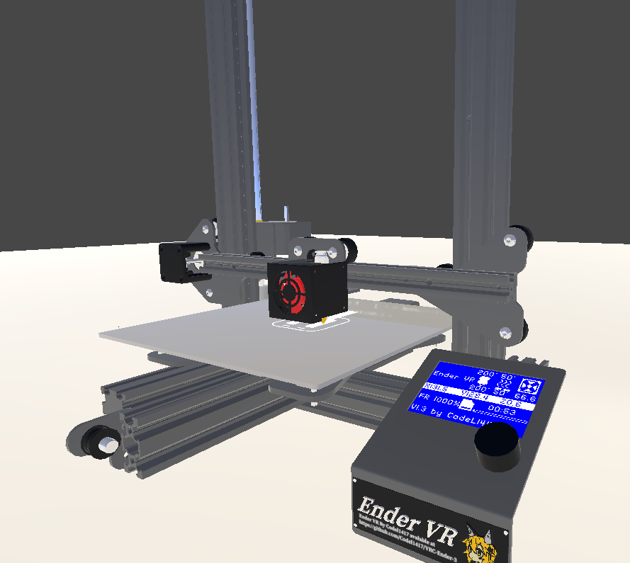
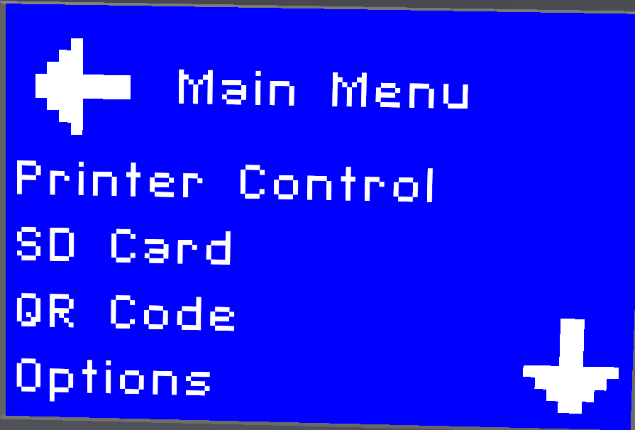
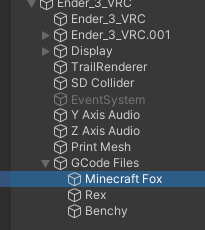
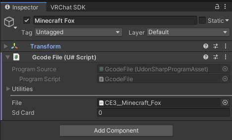
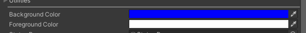
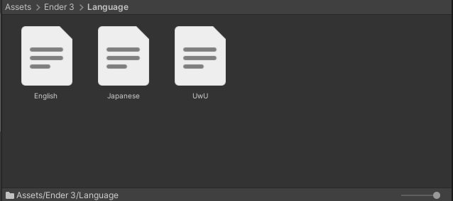

# VRChat Ender 3 Udon 3D Printer

This is a functional 3d printer in VRChat which prints real [Marlin](https://marlinfw.org/docs/gcode/G000-G001.html) gcode files. Print progress is synced over the network.
Supports English, UwU, and Japanese languages.




## Requirements

* [UdonSharp](https://github.com/vrchat-community/UdonSharp) by the VRChat Community

## How to use

1) Download the newest Release from [here](https://github.com/Codel1417/VRC-Ender-3/releases)
   * Please do not use the zip file, but the UnityPackage.
2) Import the project into your Unity Project.
3) Place the prefab in your world.

### Interacting with the printer

The printer uses a menu inspired by Marlin but with changes to be touch friendly. Buttons are used instead of the rotary wheel the Real Ender 3 uses.
Use your hand pointer to interact with the printer. Clicking anywhere on the status screen will open the menu.



### Adding your own GCode to the printer
1) Change the file extension of your '.gcode file to '.txt'.
    * You may need to Check 'Show File Extensions' in windows explorer.
2) Duplicate a GameObject under ``Ender_3_VRC/GCode Files``.



7) Set ``File`` to your GCode file '.txt'.
8) Set the GameObject name to your Model name. This is the name that will be displayed in the UI.



Compatible GCode can be generated in any Marlin compatible slicer. [Ultimaker Cura](https://ultimaker.com/software/ultimaker-cura) with the Ender 3 profile works great.

### Customization

The display colors can be set in the Display object. These colors are applied at world load.



## What is GCode?

GCode is a text file that contains commands for a 3D printer to execute. these commands are simple. Go here, Set Temperature, Put plastic between two points.

#### Example GCode
```
M190 S65 ; Set Bed Temperature to 65C
M109 S225 ; Set Hotend Temperature to 225C
G1 X0.1 Y20 Z0.3 F5000.0 ; Move to start position
G1 X0.1 Y200.0 Z0.3 F1500.0 E15 ; Draw the first line
G1 X0.4 Y200.0 Z0.3 F5000.0 ; Move to side a little
G1 X0.4 Y20 Z0.3 F1500.0 E30 ; Draw the second line
```

### Supported GCode commands

* G0/G1 Linear Move
* G28 Auto Home
* G90 Absolute Positioning
* M25 Pause
* M73 Set Print Progress
* M82 Relative Positioning
* M104 Set Hotend Temperature
* M106 Set Fan Speed
* M107 Fan Off
* M109 Wait For Hotend Temperature
* M117 LCD Print
* M118 Serial Print
* M140 Set Bed Temperature
* M190 Wait For Bed Temperature

## Notes

* Print Bed size is 235X 235Y 250Z.
* Minimum extrusion temperature is 160C (Cold Extrusion Protection).
* Incapable of filament pressure simulation.
* Supports are unnecessary as gravity is a relic of the past.
* Please do not remove any credits given, Just append to the credits pages.
* Due to the Oculus Quest's lack of geometry shader support, the printer **will not** work on Quest. It will move and print but the printed part will be invisible.

## Credits

* Filament Shader by [Lyuma](https://github.com/lyuma)
* Lighting Template by [Xiexe](https://github.com/Xiexe)
* UdonSharp by [VRChat Community](https://github.com/vrchat-community/UdonSharp)  
* Localization by [DeepL](https://www.deepl.com/translator)

## License

Licensed under the [MIT License](LICENSE).

# Other Information

## Adding a language

To add support for an additional language, just place the text file in the Assets/Ender 3/Language folder. The name of the file should be the same as the language.
On Upload/Play the script will automatically detect the languages.

